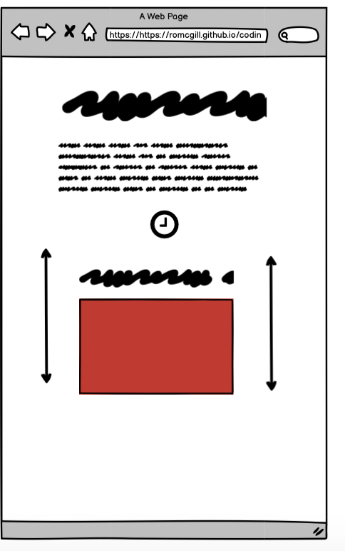
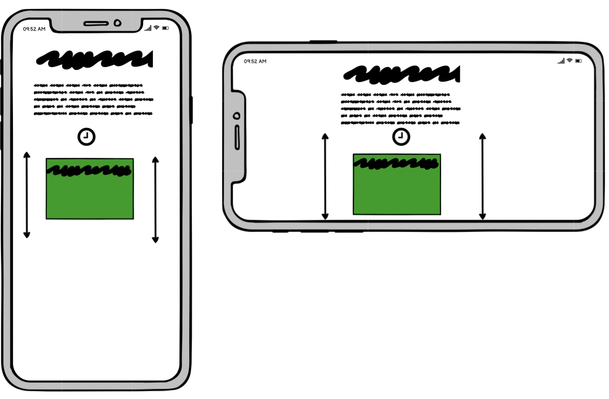

## Bug


monday 21st feb
JS code to show random phrase from string is showing undefined instead of daata from the string (could be a simple spelling/syntax error)

fix "simple syntax erroe forgot to put = after const before string of lines "


issue i am having is figuring out how to link the current level and the diffrent level buttons 
I am thinking an if statement ( if easy clicked set level to easy ) or (on mouse click set current level to event ? )


bug cant get animation to reset when correct answer is typed 

fix .... dom reflow as advised by tutor supporrt ....?


tuesday 1st of march bug 
code to show alert that user has lost the game when time reches 0 wont go away because time is still ===0 

fix ......     ......  ?


# **Code Hero**

Code Hero is a site for people to practice basic HTML coding In a semi cometitive environment While also having fun.

-----
Live site: https://romcgill.github.io/coding-game/

-----


-----
<details>
<summary>Table of Contents </summary>

* [User Experience (UX)](#user-experience--ux-)
    + [User stories](#user-stories)
      - [First Time Visitor Goals](#first-time-visitor-goals)
      - [Returning Visitor Goals](#returning-visitor-goals)
      - [Frequent User Goals](#frequent-user-goals)
  * [Design](#design)
    + [Colour Scheme](#colour-scheme)
  * [Typography](#typography)
  * [Imagery](#imagery)
* [Wireframes](#wireframes)
    + [Home Page Wireframe](#home-page-wireframe)
    + [Mobile Wireframe -](#mobile-wireframe--)
    + [genre pages and footer](#genre-pages-and-footer)
    + [Genre page and footer mobile](#genre-page-and-footer-mobile)
    + [Contribute Page Wireframe](#contribute-page-wireframe)
    + [Contribute page wireframe mobile](#contribute-page-wireframe-mobile)
* [Features](#features)
    + [* New Feature *](#--new-feature--)
    + [Existing Features](#existing-features)
  * [Features still to be added.](#features-still-to-be-added)
* [Testing](#testing)
    + [Accesability](#accesability)
    + [Functionality](#functionality)
    + [Visual asthetic](#visual-asthetic)
* [Bugs/Fixes](#bugs-fixes)
* [Deployment](#deployment)
* [Technologies used](#technologies-used)
    + [Balsamiq](#balsamiq)
    + [Font Awesome](#font-awesome)
    + [Coolors.co](#coolorsco)
    + [Chrome DevTools](#chrome-devtools)
    + [Google Fonts](#google-fonts)
    + [Formspree](#formspree)
    + [W3C Validation Servicees](#w3c-validation-servicees)
    + [Gitpod](#gitpod)
* [Credits](#credits)
    + [Content and media](#content-and-media)
    + [Ackwnowledgements](#ackwnowledgements)

<small><I><a href='http://ecotrust-canada.github.io/markdown-toc/'>Table of contents generated with markdown-toc</a></I></small>


</details>

-----

 
 


## User Experience (UX)
--------------------

### User Stories

#### First Time Visitor Goals

-   As a First Time Visitor, I want to easily understand the game and why I should be interested in it.

-   ![]
-   As a First Time Visitor, I want to be able to easily navigate to the game and find content that relates to my interests.

![]


-   As a First Time Visitor, I want to be excited, intrigued and feel I am in a fun environment where i can practice typing code.

![]

#### Returning Visitor Goals

-   As a Returning Visitor, I want to try and beat my previous scores.

![] insert image

-   As a Returning Visitor, I want to feel as though I am not playiing the same game with the same content over and over again.

![]insert image

-   As a Returning Visitor, I want to better my skills and boost my confidence in writing HTML code.

![]insert image
#### Frequent User Goals

-   As a Frequent User, I want .

-   As a Frequent User, I want to .

-   As a Frequent User, I want to .

-  As a Frequent User I want to. 

## Design
_____
### Colour Scheme

-   The colour scheme used is Black, White and Alice Blue for great contrast and readability. Imagery was used to add extra pops of colour and interest to the basic palette.


## Typography

sans-serif font is the main font used throughout the whole website, I have chose to use this font as it it web safe and stable on all devices and browsers. I have used the 
Image result for avatar font
Papyrus font in the Fantasy family. This font is easy to read and also Intresting and familiar to the user as it is a widley used font.

```r
.body{
    font-family: sans-serif;
}

.heading{
    font-family: Fantasy;
}
```

## Imagery


-The imagery (look and feel) used was done to create a sense of retro Gaming and old school " Hacking " link in the movies 


![]insert image

When the site is viewed on a mobile device it will function as supposed to but the player will be at a disadvantage as thumbb typing is not very efficient for typing HTML code.


#  Wireframes
### Desktop Wireframe for correct answer


### Desktop Wireframe for incorrect answer


### Small desktop Wireframe for correct answer


### Small desktop Wireframe for incorrect answer


### Mobile Wireframe for correct answer


### Mobile Wireframe for incorrect answer


## Features
____
### * New Feature *


### Existing Features
1. The design of the site is fully responsive on all modern devices.
> " As a Frequent User I want to use the site on my phone while I am away from my desk."
- The site uses a combination of the Grid layout and media queries to achieve this.

Example (code for characters to re-align if screen width is less than 800px) 
```
enter code here
```


-----------

2.  The site is easy to navigate 
> " As a First Time Visitor, I want to be able to easily navigate throughout the site to find content that relates to my interests."
-   enter text here

Example (enter feature here.) 

HTML
```{r}. 
 enter code here
```    
CSS      
```{r}.
 
```

![screenshot of nav bar]insert image

------

3. The footer element is at the bottom of each page with clearly defined social media links represented by icons.
> " As Returning Visitor, I want to find community links and a way to personally connect with other community members on a platform that I am more familiar with."
- The site uses icons from fontawesome.com to achieve this and some css styling to make the icons match the colour scheme of the site. 


------

-----
## Features Still to be Added change these.
1. I would like the form data to be automatically uploaded onto the live site.

*When a user submits their favourite song and the meaning or story behind it I want that data to be uploaded to the site instantly or after an approval phase.*

- This would require more knowledge of Java Script and backend frameworks.
I have looked into this and have found someone using Google Apps Script to populate a google sheet from form data entries you can view this here. (https://support.google.com/docs/thread/48344518/solved-auto-update-auto-populate-the-form-with-realtime-data-from-sheet-after-response-is-submitted?hl=en).  
- I think another way to achieve this could be to create a forum page and have the action of post and the URL linked to a new forum submission so when a user enters data into the form it will get sent to the new submissions area on the forum page. This may not be the best way to implement such a feature but might be my only option without knowledge of java script or any backend frameworks or API's.  

2. I would like to have a hamburger menu on my nav bar for when viewing on mobile devices.  
*On some devices the links can be cluttered and lack breathing room which I think negatively impacts the asthetic of the nav bar*. 
This is possible to do with javascript and a media query and I intend to add this feature soon. I have started my research on youtube to grasp the basic concept one video I found helpful was https://www.youtube.com/watch?v=dIyVTjJAkLw&t=200s

3. I would like to add the option to create an account and store users information and allow them to post/upload directly onto the site. To achieve this I would need more backend knowledge from what I have seen in this video https://www.youtube.com/watch?v=gCo6JqGMi30 it seems like PHP and MYSQLi databases must be used also.

4. I would like to add a content block that bolcks mature content, in the case of explicit language or mature content. Java Script is required for this so I intend to add it at a later date. My research has brought me here https://vpsfix.com/1806/adult-content-warning-javascript-image-hosting-sites/ This details the process to add an adult content warning to the page as you enter. I want only relevent content to be blocked with a small checkbox above that the user must click to gain access to the content, all other content would still be visible if the checkbox was left unchecked.


------
## Testing change this 


 The site is written with only HTML and CSS my testing will be focused on accessibility,functionality and the visual asthetic.  
 1. #### Accessability
 To test the accessibility of my site I carried out some manual testing using google dev tools, amiresponsive and different devices and screen sizes. One thing I was looking for was if my media queries were performing as expected. To achieve this I used dev tools to resize each page of the site in each test the media queries functions how I expected without fault.
 2. #### Functionality
 - To test the functionality of the site I used a combination of manual testing and markup validators. Using the W3C markup validator the site had no errors or warnings to show on any page.
 
 I generated a lighthouse report on dev tools and recieved 100 on accessibility, best practice and SEO and 78 on performance. This issue was soon fixed by resizing my images and using tinypng.com to compress each png file to make it a smaller file size for faster load times, I also received some advice on stack overflow to preload my hero image. Using these three methods I got the performance score up to 100. due to a function google has in active development I am no longer receiving 100 in best practice, the score is now at 93.
 
 
 
 I am confident once google fixes this bug my site will achieve 100 in every category.
 I used the The W3C CSS Validation Service to test my CSS code, The result came back with no errors.
 
 - Manual Testing. 
 To test the site manually I ensured that all links opened to the correct page and all of the pages in the nav bar lead to the correct destination. I have also made many submissions into the form to make sure that everything is functioning as it should, throughout the process of coding the website I was continuously testing every feature added and never left a feature that didnt work in the project until it was fully functional.
3. #### Visual aesthetic
 - I manually checked the colours on my site using colors.co, I did this because I felt that the contrast validators were not great at recognising where the colours are on the page. They try to contrast two colours that are not relevant to eachother. Using colors.co the contrast between the text and background received a score of 11.63 and 4 out of 5 stars.
 
----
 ## Bugs/Fixes add current  
 
 1. 
 

------
## Deployment

For this project I have used Gitpod. throughout the process I have been adding and committing code to my Github repository. From there I can deploy my live site to make it accessible to everyone. I do this by using Github Pages.  
1.
From my Github repository navigate to settings on the far right near the top of the page


2.
In the left hand side of the screen there will be a list of options, from these options select pages
   
3.
When in the pages section select "branch : main" as the source and ensure the directory is selected as "/(root)"
then click save. (my save button is currently grey and unclickable as I have aready deployed my site). 

 
4.
When all of the previous steps are complete you should be given this message


The site is now live and ready to view by anyone with the link. It can take Github a couple of minutes to push all of the data to the live site and to publish the page.

## Forking the GitHub Repository. 

By forking the GitHub Repository we make a copy of the original repository on our GitHub account to view and/or make changes without affecting the original repository by using the following steps...

Log in to GitHub and locate the GitHub Repository
At the top of the Repository (not top of page) just above the "Settings" Button on the menu, locate the "Fork" Button.
You should now have a copy of the original repository in your GitHub account.

## Making a Local Clone

Log in to GitHub and locate the GitHub Repository
Under the repository name, click "Clone or download".
To clone the repository using HTTPS, under "Clone with HTTPS", copy the link.
Open Git Bash
Change the current working directory to the location where you want the cloned directory to be made.
Type git clone, and then paste the URL you copied in Step 3.
$ git clone https://github.com/YOUR-USERNAME/YOUR-REPOSITORY
Press Enter. Your local clone will be created. 
```
 git clone : https://github.com/YOUR-USERNAME/YOUR-REPOSITORY"
- Cloning into `CI-Clone`...
- remote: Counting objects: 10, done.
- remote: Compressing objects: 100% (8/8), done.
- remove: Total 10 (delta 1), reused 10 (delta 1)
- Unpacking objects: 100% (10/10), done.
```

## Technologies Used 
------
### Languages Used

- HTML5
- CSS
-Java Script

 ### Balsamiq
Balsamiq was used to create wireframes for the project

### Font Awesome
The project uses icons from Font Awesome in the nav bar

### Coolors.co
The colour scheme and palette were generated and tested using coolors.co


### Chrome DevTools
This was used to test and debug my site as I went through the process of building it.
The lighthouse feature was used to create a report on the performance of the site.

### Google Fonts
The fonts used on the site are imported from Google Fonts.

### Formspree
This was used to link my contribute form directly to my email address.


### W3C Validation Services
These services were used to validate my css and HTML code to ensure there was no errors.

### Gitpod
This was my IDE and where I wrote all of my code, Made commits and pushed to Github.

## Credits
-----
### Content and media chnage this 
- https://www.wikipedia.org/ for information on music genres.
- https://www.billboard.com/ + https://www.rollingstone.com/ for in depth information on the songs and artists.
- https://www.freepik.com/ + https://www.shutterstock.com/ + https://unsplash.com/s/photos/singer for images.
- https://youtube.com/ for all video content.

### Acknowledgements chnage some

- I would like to thank my Code Institute mentor Antonio Rodriguez for all of his help, tips and feedback. 
- My Cohort facilitator Kasia for all of her help and encouragement throughout the project.
- WEB CIFAR on youtube for a great video on how to set up formspree
- The stackoverflow community for responding to questions and having built up a massive database of invaluable tips,tricks and bug fixes
- https://medium.com/ for teaching the bounce animation in a clear way
- W3schools.com for easy to follow lessons on Grid and Flex
- Kevin Powell on youtube for all of his Css tips and tricks.
- Fellow students at Code Institute for answering all of my questions.
- Peter Szabo for his attention to detail and great feedback.
- Code Institute for supplying an amazing course, from the content to the staff and alumni. 


