# **Code Hero**

Code Hero is a site for people to practice basic HTML coding In a semi cometitive environment While also having fun.

-----
Live site: https://romcgill.github.io/coding-game/

-----

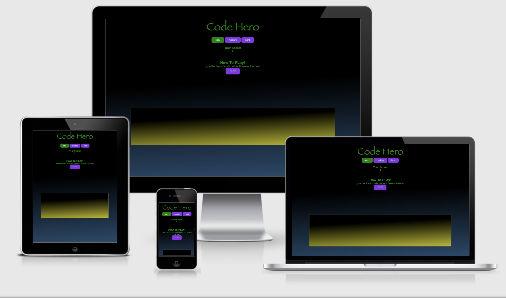

-----
<details>
<summary>Table of Contents </summary>

* [User Experience (UX)](#user-experience--ux-)
    + [User stories](#user-stories)
      - [First Time Visitor Goals](#first-time-visitor-goals)
      - [Returning Visitor Goals](#returning-visitor-goals)
      - [Frequent User Goals](#frequent-user-goals)
  * [Design](#design)
    + [Colour Scheme](#colour-scheme)
  * [Typography](#typography)
  * [Imagery](#imagery)
* [Wireframes](#wireframes)
    + [Home Page Wireframe](#home-page-wireframe)
    + [Mobile Wireframe -](#mobile-wireframe--)
    + [genre pages and footer](#genre-pages-and-footer)
    + [Genre page and footer mobile](#genre-page-and-footer-mobile)
    + [Contribute Page Wireframe](#contribute-page-wireframe)
    + [Contribute page wireframe mobile](#contribute-page-wireframe-mobile)
* [Features](#features)
    + [* New Feature *](#--new-feature--)
    + [Existing Features](#existing-features)
  * [Features still to be added.](#features-still-to-be-added)
* [Testing](#testing)
    + [Accesability](#accesability)
    + [Functionality](#functionality)
    + [Visual asthetic](#visual-asthetic)
* [Bugs/Fixes](#bugs-fixes)
* [Deployment](#deployment)
* [Technologies used](#technologies-used)
    + [Balsamiq](#balsamiq)
    + [Font Awesome](#font-awesome)
    + [Coolors.co](#coolorsco)
    + [Chrome DevTools](#chrome-devtools)
    + [Google Fonts](#google-fonts)
    + [Formspree](#formspree)
    + [W3C Validation Servicees](#w3c-validation-servicees)
    + [Gitpod](#gitpod)
* [Credits](#credits)
    + [Content and media](#content-and-media)
    + [Ackwnowledgements](#ackwnowledgements)

<small><I><a href='http://ecotrust-canada.github.io/markdown-toc/'>Table of contents generated with markdown-toc</a></I></small>


</details>

-----

 
 


## User Experience (UX)
--------------------

### User Stories

#### First Time Visitor Goals

-   As a First Time Visitor, I want to easily understand the game and why I should be interested in it.

-   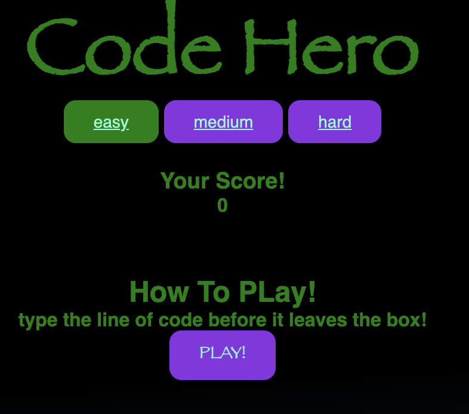
-   As a First Time Visitor, I want to be able to easily navigate to the game and find content that relates to my interests.


-   As a First Time Visitor, I want to be excited, intrigued and feel I am in a fun environment where i can practice typing code.

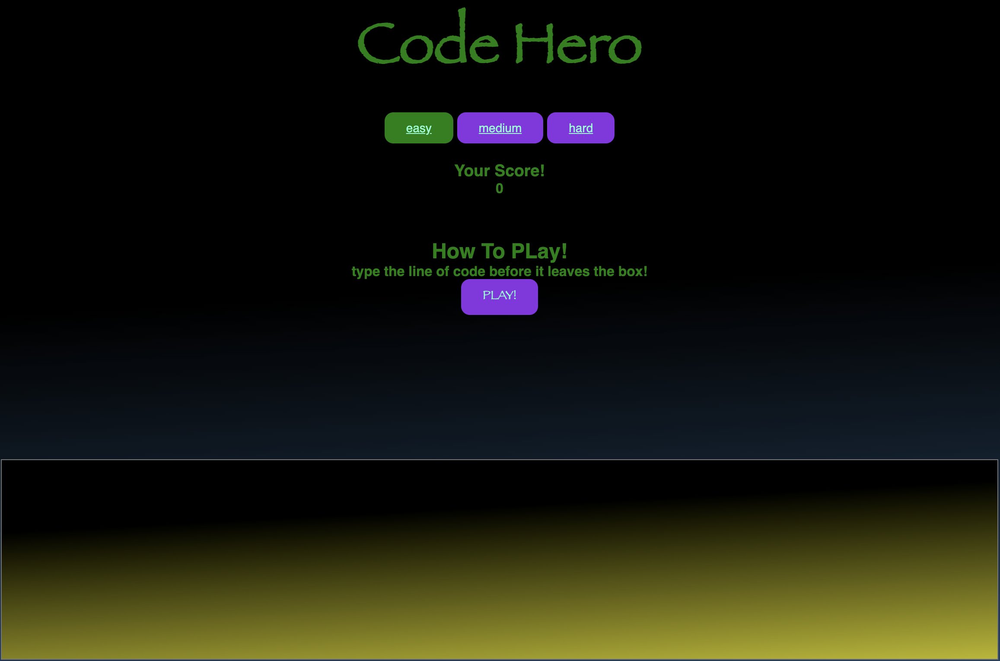

#### Returning Visitor Goals

-   As a Returning Visitor, I want to try and beat my previous scores.

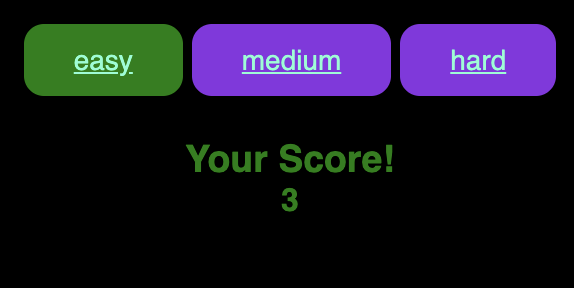

-   As a Returning Visitor, I want to feel as though I am not playiing the same game with the same content over and over again.


-   As a Returning Visitor, I want to better my skills and boost my confidence in writing HTML code.


#### Frequent User Goals

-   As a Frequent User, I want there to be new code blocks for me to practice a more diverse range of code 

-   As a Frequent User, I want to be able to change dificulty levels as my coding skills improve 

-   As a Frequent User, I want to be challenged.

-  As a Frequent User I dont want to be hindered by technical issues in the game.

## Design
_____
### Colour Scheme

-   The colour scheme used is black, green and a range of blue and purple gradients. the black background is remineccent of old school coding (hackers) and retro video games, i think it suits the function of the site perfectly.


## Typography

Fantasy and sans-serif font-familys are the main font used throughout the site, I have chose to use these  as they are web safe and stable on all devices and browsers.
the standard font in the Fantasy family is papyrus (the avatar font)
. This font is easy to read and also Intresting and familiar to the user as it is widley used.


```r
.body{
    font-family: sans-serif;
}

.heading{
    font-family: Fantasy;
}
```

## Imagery


-The imagery used was purposefully done to create a sense of nostalgia with a theme of retro Gaming and old school " Hacking " like in the movies  


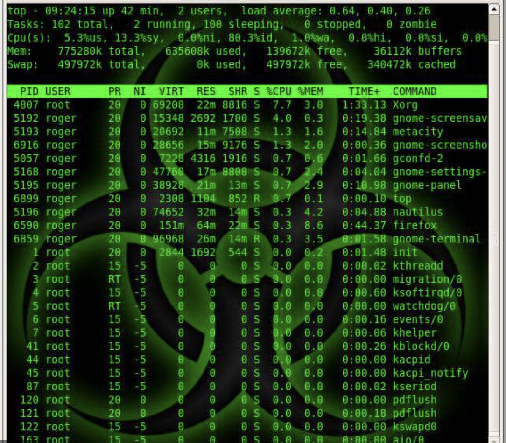


When the site is viewed on a mobile device it will function as it is supposed to, As it is fully responsive on all devices. but the player will be at a disadvantage as thumb typing is not very efficient for typing HTML code.
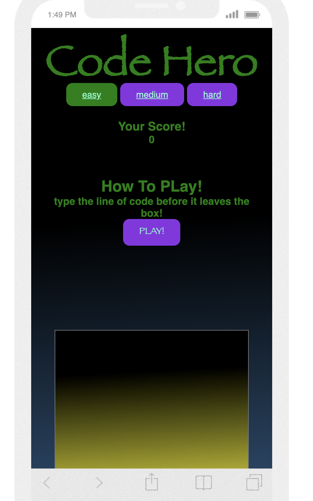
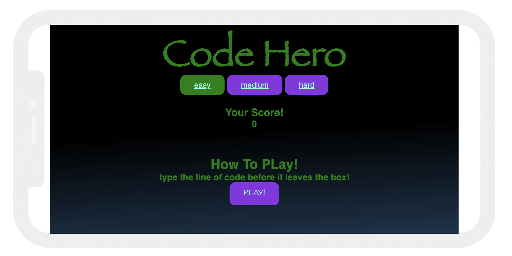


#  Wireframes
### Desktop Wireframe for correct answer


### Desktop Wireframe for incorrect answer


### Small desktop Wireframe for correct answer


### Small desktop Wireframe for incorrect answer


### Mobile Wireframe for correct answer


### Mobile Wireframe for incorrect answer


## Features
-------
### Existing Features
#### 1. The design of the game is fully responsive on all modern devices.
> " As a Frequent User I want to play the game on my phone while I am away from my desk."
- The Game uses vh and vw units of measurement when setting the sizes of every element. this is to ensure that every screen size is catered for. In the case of some smaller screen sizes I used media queries to and more padding to the heading and changed the font size as I did not want text that would cover eachother.

I also added a media query that adjusts some of the padding for the game play area and the button container when a device is orientated to landscape.


Example
```
.game-play-area{
  
    width: 90vw;
    height: 40vh;
}
    @media screen and (orientation:landscape) {
    .btn-container{
        padding-top: 50px;
    }
    .game-play-area{
        margin-top: 5px;
    }
}
```


-----------

#### 2. The game is easy to navigate and understand 
> " As a First Time Visitor, I want to easily understand the game and why I should be interested in it.
."
-   the game is uncomplicated as it gives you only one goal to achieve "type the line of code before it reaches the bottom of the box" as the lines of code change randomly each time this also keeps the game fresh and exciting.

Example (random lines of code  pulled from string)

JS
```{r}. 
const lines =
[
    '<h1>Heading</h1>',
    '<p>Paragraph</p>',
    '<h1>big title</h1>',
    '<h5>small title</h5>',
    '<h2>descriptive subtitle</h2>',
]
 function showLine(lines){
    const randIndex = Math.floor(Math.random() * lines.length);
    currentLine.innerText = lines[randIndex];
```    


------

#### 3. Focus the text area
for the text area i used focus so that when an answer is typed or the game begins the area is ready for input, This means the player does not have to click into the text area every time they want to type an answer. the text area also turns green when the correct answer is entered and is stays yellow when the current text does not match the current line of code.

JS
```{r}. 
function checkInput(){
    if (textInput.value === currentLine.innerText){
        setInterval(checkStatus, 50)
        message.innerText = 'Correct'
        showLine(lines);
        time=18;
        currentLine.classList.remove("linedown");
        void currentLine.offsetWidth; 
        currentLine.classList.add("linedown");
        textInput.value='';
        textInput.classList.add('correct-background')
    }else{
        textInput.classList.remove('correct-background')
        message.innerText = ''
```
CSS
```{r}
.incorrect-background{
    background: rgb(0,0,0);
    background: linear-gradient(177deg, rgba(0,0,0,1) 29%, rgb(185, 183, 14) 100%, rgba(0,157,255,1) 100%);
}
.correct-background{
    background: rgb(0,0,0);
    background: linear-gradient(177deg, rgba(0,0,0,1) 29%, rgb(40, 147, 45) 100%, rgba(0,157,255,1) 100%);
}
```

#### 4. Anticheat, 
I have added a feature that will not allow players to cheat by using copy and paste to get the correct answer in the box immediately. To stop this I added an event listener to listen for 'paste' in the text area, when paste is (heard) the event listenr will fire and add the text No Cheating! into the textarea. and also by using prevent default the user will be unable to paste into the text area afterwards 


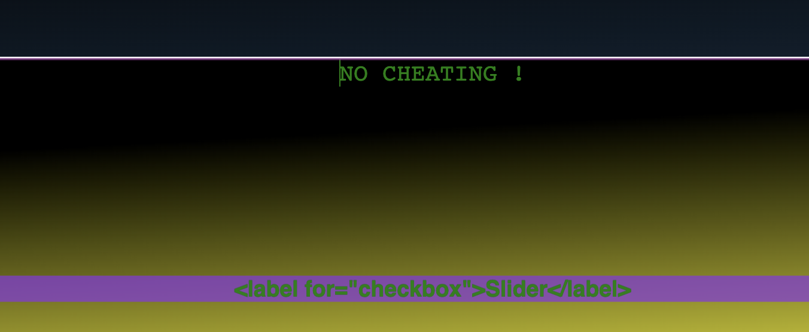


JS
```{r}
textInput.addEventListener(
    'paste', (e) => {
        e.preventDefault();
        textInput.innerText = ("NO CHEATING !");
        console.log("NO CHEATING !");
```

#### 5. score counter, 
I have added a score counter that keeps track of every time a user gets an answer correct. and increments by 1 each time, this score is then shown in the modal that is displayed when the user looses. When the modal is closed the score is reset back to 0.


#### 6. (linedown) animation,
 this feature is the heart and soul of the game, the animation is simple yet affective. It targets the random code block that is pulled from the string and drops it down the screen at a steady pace, this creates a sence of urgency and competitiveness for the user.

JS
```{r}
restart.onclick = function(){
    showLine(lines)
    time=18;
    displayScore();
    currentLine.classList.remove("linedown");
    void currentLine.offsetWidth; 
    currentLine.classList.add("linedown");
    focusTextarea()
}
```

CSS
```{r}
.linedown {
    top: 0;
    opacity: 0;
    animation: new-item-animation 20s linear forwards;
    color: green;
    background-color: rgba(138, 43, 226, 0.7);
    border-radius: 25px;
    box-shadow: 5px;
}

@keyframes new-item-animation {
    from {
        opacity: 1;
        transform: translateY(0);
}

    to {
        opacity: 1;
        transform : translateY(400px);
    }
}

```

HTML
```{r}
<div class="game-area">
        <h3 id="current-phrase" class="linedown"></h3>
```

#### 7. Game Over modal, 
this feature is a modal that apears when the timer hits 0. this means the player did not type out the codeblock in time and therefore losses the game. when the modal apears it will show the text Game over and show the players score, if the player wishes to play again they can close the modal with the close button and click play
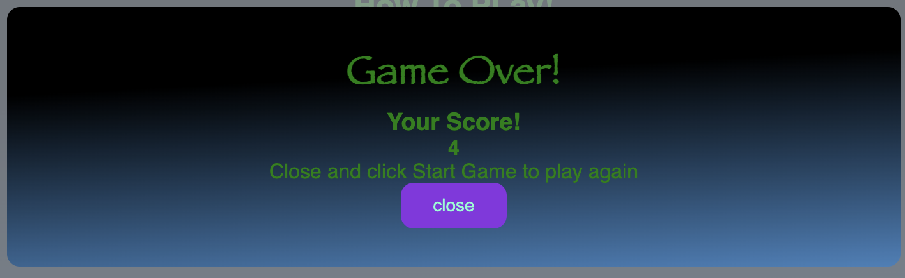

#### 8. Dificulty select,
 at the top of the page under the heading there are 3 "buttons" to choose easy medium or hard, theese buttons will load easy,medium or hard words into the game, this makes the game accesable to all players no matter there skill level or experience.

 

#### 9. text area background colour,
 the background colour of the text area changes to green if the input matches the code block, if not the background remains a shade of yellow to visualy tell the player there input is not correct. this is a non intrusive subtle way of informing the player of how they are doing without distracting them.

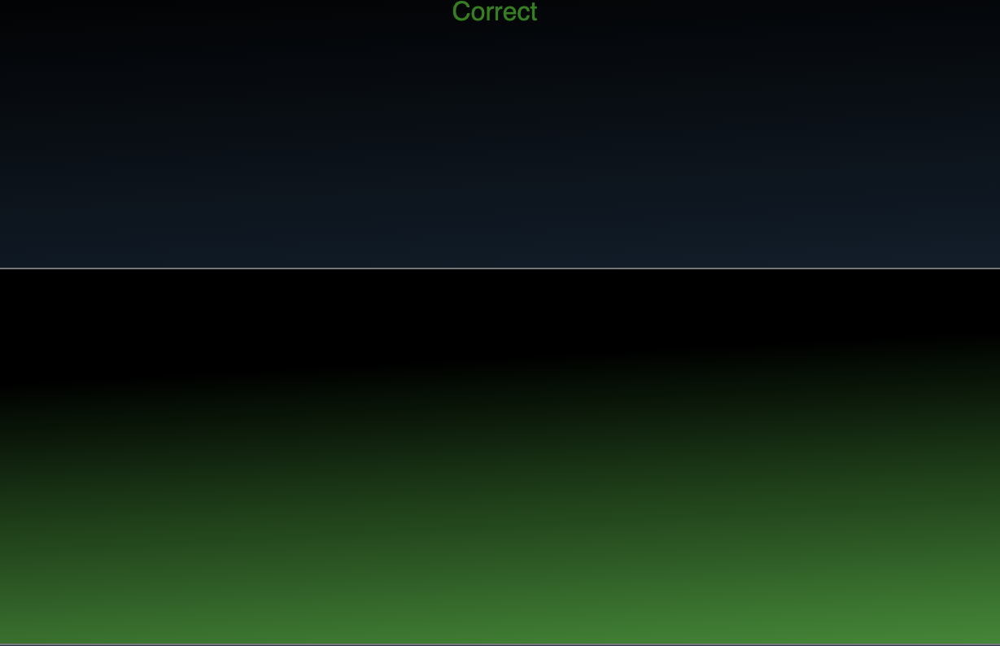
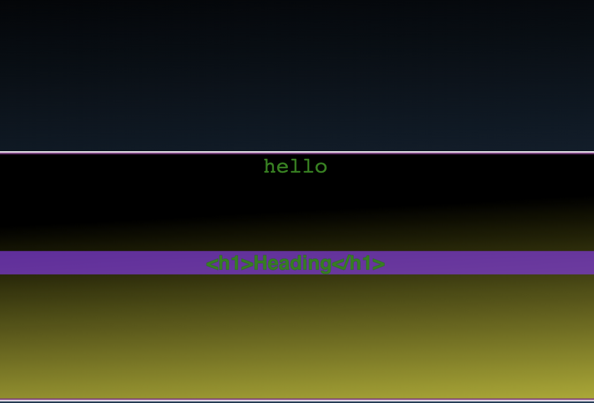


------

-----
## Features Still to be Added.
2. score board/local storage of score and email score to user 
------
## Testing


 The site is written with HTML, CSS and Java Script my testing will be focused on accessibility, functionality and the visual asthetic/.  
 1. #### Accessability/responsiveness
 To test the accessibility of my site I carried out some manual testing using google dev tools, amiresponsive and different devices and screen sizes. my main objective was to ensure that my game was fully playable on all devices but paying more atention to devices with bigger screen sizes as these devices are primarly used with a keyboard which is highly advised when playing the game as thumb typing on a phone or smaller device will leave the user at a big disadvantage.I also manualy checked all sizes by using chromes dev tools.(I used vh and vw units of measurement to achive responsivness on this site)
 2. #### Functionality
 - To test the functionality of the site I used a combination of manual testing and markup validators. Using the W3C markup validator and the w3cssvalidator the site had no errors and one warning, this warning was caused by my function that gets a random code block from a string. this code block is then displayed in this h3 element.
 i also tested my Java Script code on jshint.com where the code recieved one warning.
 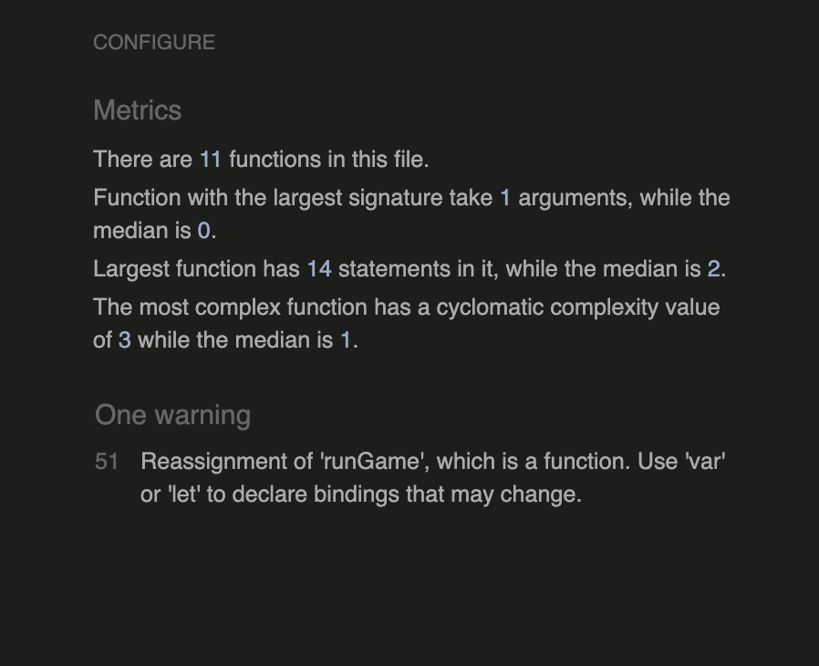
 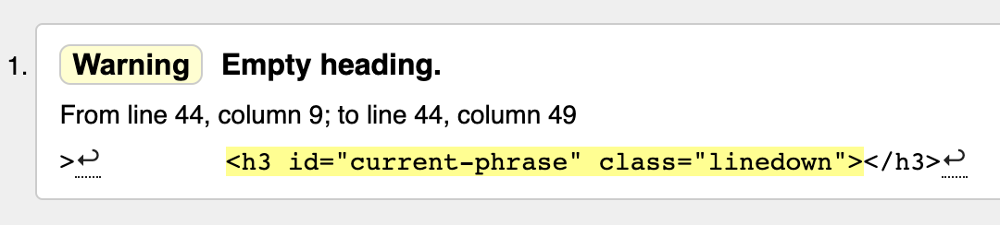


 I generated a lighthouse report on dev tools
 and recived 100 on everything apart from accesability, this was down to a few style choices I have made and believe they are right for the game.
 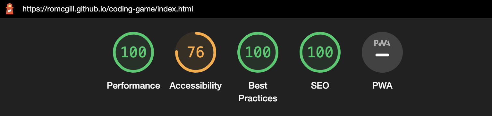

 
 - Manual Testing. 
 To test the site/game manually I played it many times and console loged my functions along the way to ensure they were being called when I wanted them. throughout the process of coding the website I was continuously testing every feature added and never left a feature that didnt work in the project until it was fully functional. I did this by commenting out code that did not work then uncommenting it as i was working on it.
3. #### Visual aesthetic
 - I manually checked the colours on my site using colors.co, I also recived alot of feedback from my class mates on slack early on that my first colour scheme was not acceptable, After the changes I made I belive that the contrasting colours work well together. I did this because I felt that the contrast validators were not great at recognising where the colours are on the page. They try to contrast two colours that are not relevant to eachother. 

----
 ## Bugs/Fixes
 
### 1. monday 21st feb

function to show random code block from string is showing undefined instead of code block from the string. first toughts is it could be a simple spelling/syntax error)
### Fix
 sytax error, missing = in ```const = lines[]```


 ### 2. adding dififculty levels,
my first toughts there are 3 possibel ways I will go about doing this
option 1. is to have the timer set a difffrent times depending on which button the user clicks for example : hard = 10 seconds easy = 30 seconds.
option 2. is to change the size of the text area, aswell as the time i think I could do this with media queries exampe: if hard button clicked textarea = 10vh by 80 vw, this along with a shortend timer would make for a very seamless chnage in the dificulty of the game. option 3 is to divide my string into 3 seperate strings easy medium and hard, with shorter lines of code in easy, long lines of code in hard and so on.The issue i will face here will be with my function that pulls the random line from the string. 

### Fix
I have solved this bug, by using none of the above methods, The method I used was to duplicate my JS and index.html file twice and link the index files to their own js files. inside thes js files i changed the string with the code blocks to only have short code blocks for the js file linked to easy, medium lenght blocks for medium and long lenght blocks for hard I then added hrefs to the top of each page with css styling to make which ever page you are on the background color of the href would be green. the method I used functions as buttons to click and selelct you dificulty before playing the game.


### 3. cant get animation to reset when correct answer is typed into text area

### Fix
 as adviced by tutor support i created a dom reflow and made the animation void when the answer was correct then my function to start the animation is called again


### tuesday 1st of march bug 
### 4. code to show alert that user has lost the game when time reches 0 wont go away because time is still === 0 

### Fix
 to fix this and improve upon it i created a modal to display when a player has lost the game (time == 0) I then added a function that is called when the close button on the modal is clicked. this function resets the time and current codeblock.
```{r}

closeModal.onclick = function() {
    modalContainer.style.display='none';
    time = ''
    textInput.value='';     ......  ?

```


### 5. issue with incorrect line of code staying in the text area when the game ends,
this would make the user delete the code before typing in a new line which would ruin the flow of the game.

### Fix
 this fix was similar to how i managed to fix the last bug, in the modal close function I added textInput.value=''; this will clear the text area and allow the game to start fresh after a user looses and tries to play again.


### 6. score counter not showing in the modal.
### Fix
this bug was caused by my lack of future proofing my code, I was using document.getelementById to get the "score from the html and that was already being used by the score counter in the game so i had to change the index.html for the score to have a class instead of an Id and then use document.getElementByClassName and target the 1st element of my display score array for the game and the 2nd element of my display score for my modal. this resolved my issue  


### 7. heading was spliting into 2 lines and droping down onto new line covering the buttons at small screen sizes.

### Fix
to fix this I added a media query and a white space no rap to the heading tag in css   
```{r}
 white-space: nowrap;
}
@media only screen and (max-width: 352px) {
    .heading { 
        font-size: 20pt;
    }
}
```


------
## Deployment

For this project I have used Gitpod. throughout the process I have been adding and committing code to my Github repository. From there I can deploy my live site to make it accessible to everyone. I do this by using Github Pages.  
1.
From my Github repository navigate to settings on the far right near the top of the page


2.
In the left hand side of the screen there will be a list of options, from these options select pages
   
3.
When in the pages section select "branch : main" as the source and ensure the directory is selected as "/(root)"
then click save. (my save button is currently grey and unclickable as I have aready deployed my site). 


4.
When all of the previous steps are complete you should be given this message


The site is now live and ready to view by anyone with the link. It can take Github a couple of minutes to push all of the data to the live site and to publish the page.

## Forking the GitHub Repository. 

By forking the GitHub Repository we make a copy of the original repository on our GitHub account to view and/or make changes without affecting the original repository by using the following steps...

Log in to GitHub and locate the GitHub Repository
At the top of the Repository (not top of page) just above the "Settings" Button on the menu, locate the "Fork" Button.
You should now have a copy of the original repository in your GitHub account.

## Making a Local Clone

Log in to GitHub and locate the GitHub Repository
Under the repository name, click "Clone or download".
To clone the repository using HTTPS, under "Clone with HTTPS", copy the link.
Open Git Bash
Change the current working directory to the location where you want the cloned directory to be made.
Type git clone, and then paste the URL you copied in Step 3.
$ git clone https://github.com/YOUR-USERNAME/YOUR-REPOSITORY
Press Enter. Your local clone will be created. 
```
 git clone : https://github.com/YOUR-USERNAME/YOUR-REPOSITORY"
- Cloning into `CI-Clone`...
- remote: Counting objects: 10, done.
- remote: Compressing objects: 100% (8/8), done.
- remove: Total 10 (delta 1), reused 10 (delta 1)
- Unpacking objects: 100% (10/10), done.
```

## Technologies Used 
------
### Languages Used

- HTML5
- CSS
- Java Script

 ### Balsamiq
Balsamiq was used to create wireframes for the project


### Coolors.co
The colour scheme and palette were generated and tested using coolors.co


### Chrome DevTools
This was used to test and debug my site as I went through the process of building it.
The lighthouse feature was used to create a report on the performance of the site.

###jsHint.com
jshint was used to validate my Javascript code.

### W3C Validation Services
These services were used to validate my css and HTML code to ensure there was no errors.

### Gitpod
This was my IDE and where I wrote all of my code, Made commits and pushed to Github.

## Credits
-----
### Acknowledgements

- I would like to thank my Code Institute mentor Antonio Rodriguez for all of his help, tips and feedback. 
- My Cohort facilitator Kasia for all of her help and encouragement throughout the project.
- The stackoverflow community for responding to questions and having built up a massive database of invaluable tips,tricks and bug fixes
- W3schools.com for easy to follow lessons
- Fellow students at Code Institute for answering all of my questions.
- Code Institute for supplying an amazing course, from the content to the staff and alumni. 


